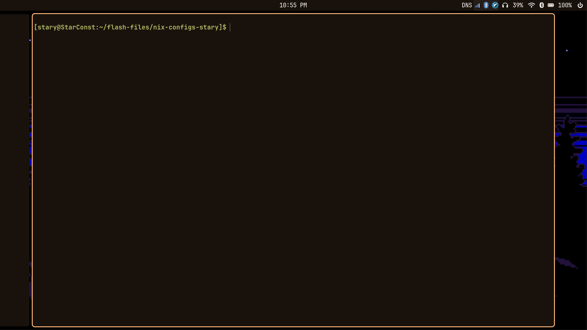
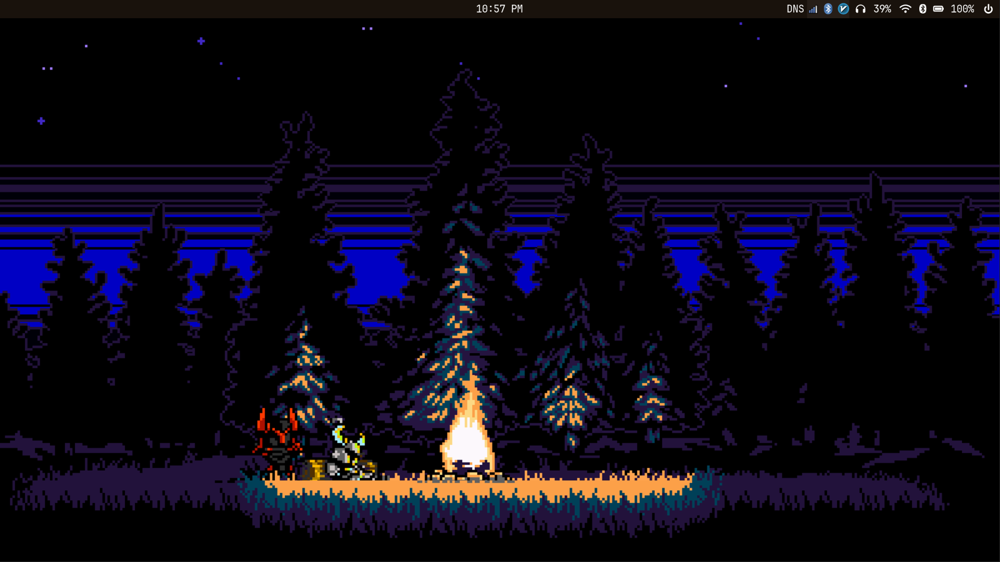
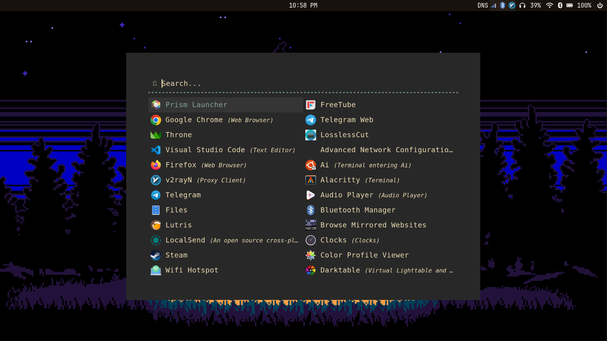

 



This repository is home to my nixos configuration, it contains configs for homemanger and nixos. homemanager updates automatically with `nixos-rebuild`.

the main working environment is niri, hyprland and gnome exist as fallback.

some programs are installed inside distrobox containers, ai tools which need a mutable environment, some packages that are broken, etc the full list is availabale [here](nixos/manual.md)

# initial setup

first setup [SSH for Github](https://docs.github.com/en/authentication/connecting-to-github-with-ssh), then clone the repo:
```bash
git clone git@github.com:stary83/nixos-configs-stary.git
cd nixos-configs-stary
```
then copy it to your real config, but first backup your current config:
```bash
# use sudo if needed
mv /etc/nixos /etc/nixos.backup
# then copy the config
cp -r nixos/ /etc/
```

currently device specific settings are seperated on a per profile basis, so first use the following command and replace your hardware-configuration.nix, make adjustments if needed:
```bash 
sudo nixos-generate-config --show-hardware-config
```

then change device-specific.nix based on your hardware, mostly gpu and cpu related stuff.

then rebuild.

note: many personal settings are located in their own file, change those as needed, here is a list of files to check: 
- git.nix
- certificates.nix
- general-settings.nix -> timezone
- networking.nix -> hostname
- ssh.nix
- users.nix 


## Updating the Repository

go to your config's git directory:
```bash
# use sudo as needed
rm -r nixos
cp -r /etc/nixos .
```

then stage, commit changes, push to github ( make sure to change to your own github ):

```bash
git add .
# add whatever comment you want
git commit -m "Update Nix configs $(date '+%Y-%m-%d %H:%M:%S')"
# use the default branch:
git push
# or push to a specific branch
git push <alias> <branch-name>
```

# Retrieving Files

```bash
git pull --rebase
```

## Troubleshooting
- **Permission Issues**: Ensure ownership of `/home/username` (`sudo chown -R username:users /home/username`). Use `sudo` for `/etc/nixos` operations.
- **Home Manager Fails**: Check for conflicting packages: `nix-env -q`. Remove: `nix-env -e '.*'`. Check logs: `journalctl -u home-manager-username`.

## Notes
- **Security**: Exclude sensitive data in `.gitignore` (e.g., secrets, backups) or encrypt with `sops-nix`.
